## Additional Experiment 1
We use `Init-NODE` to denote the NDO initialization version of NODE.

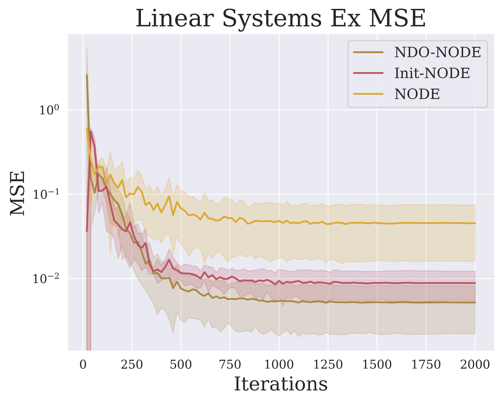

---

## Additional Experiment 2
Animations of the training processes of `NDO-NODE`, `Init-NODE`, `Vanilla NODE` on the stiff ODE problem (Section 4.2), respectively. We use `Init-NODE` to denote the NDO initialization version of NODE.

Using NDO as an constrant (`NDO-NODE`) could continuously help the training process of NODE, while it may still meet neumerical problems when using NDO as the initialization of NODE (`Init-NODE`).

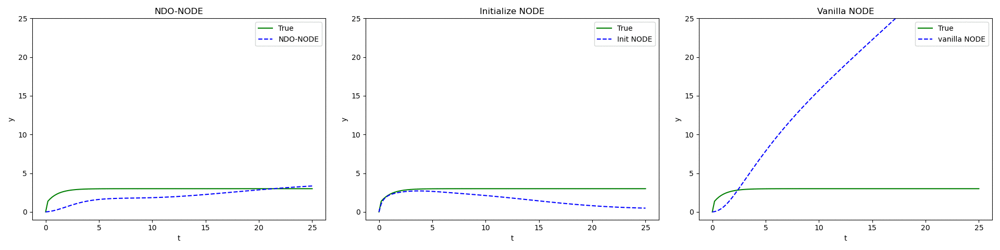

---

## Additional Experiment 3
We learn $X(t) = \frac{1}{t+0.01}$ by vanilla NODE and NDO-NODE, respectively.

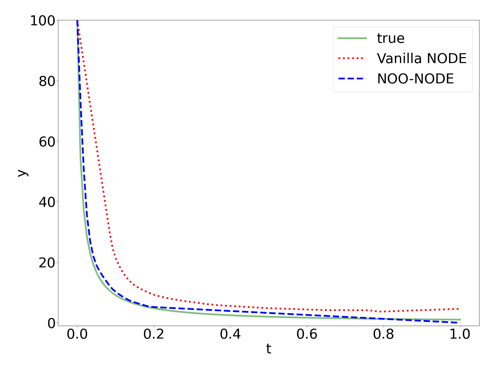

We plot true derivation $\dot{X}(t) = -\frac{1}{(t+0.01)^2}$ and NDO estimations below.
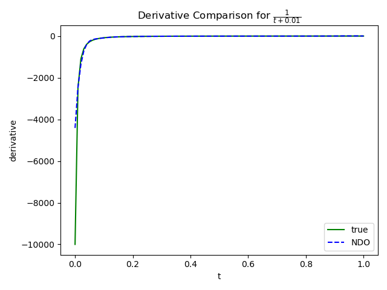

---
## Derivative Comparisons of NDO and Groundtruth

### 4.1.1 Planar Spiral Systems
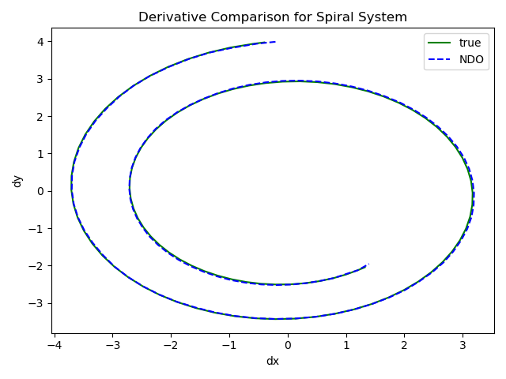

### 4.1.2 Damped Harmonic Oscillator
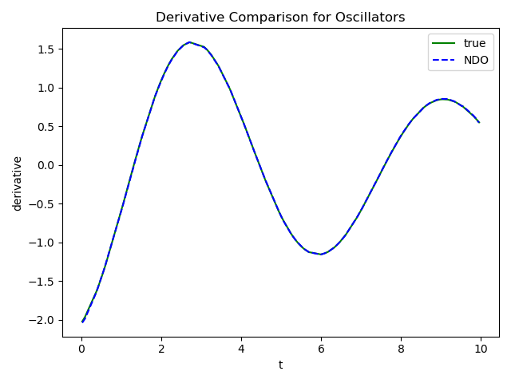

### 4.1.3 Three-body Problem
Derivatives for each body in 3D space.
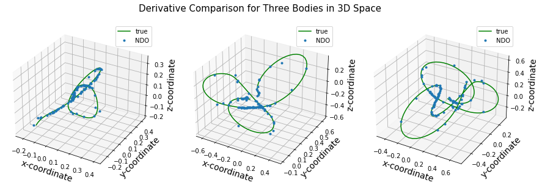

Derivatives for body 1 in each dimension.
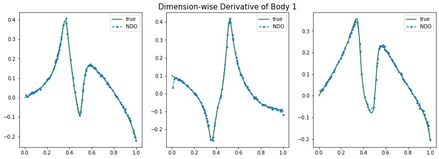

Derivatives for body 2 in each dimension.
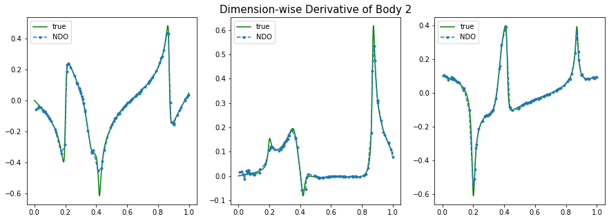

Derivatives for body 3 in each dimension.
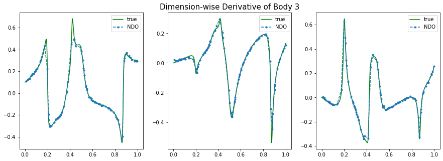

### 4.2 Stiff ODE
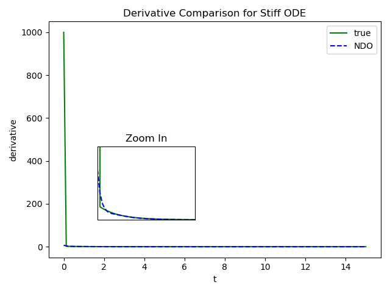

### 4.3 Airplane Vibration Dataset
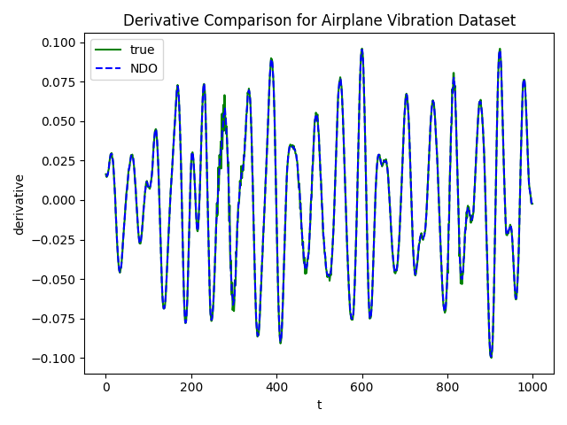
